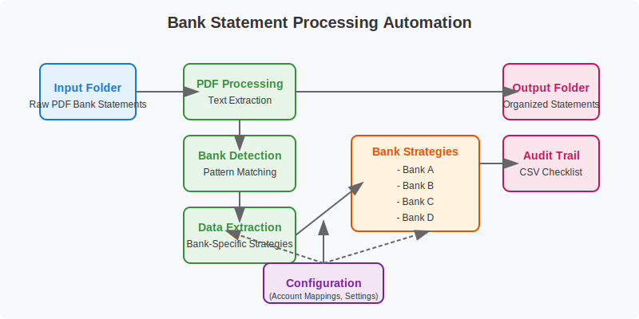

# 🏦 Bank Statement Processing Automation

## 🔍 Overview
This project demonstrates my ability to engineer practical solutions within real-world constraints. Working in an environment without an ERP system or administrative privileges, I developed a robust automation tool that transforms unstructured financial documents into a standardized, audit-ready filing system serving multiple business entities and banking institutions.

## 💼 Business Impact
- **Eliminated manual document processing** that previously consumed 5+ hours monthly across the finance team
- **Enhanced audit preparedness** by creating consistent, predictable document naming and organization
- **Reduced operational risk** through systematic validation and error detection
- **Created visibility and traceability** with comprehensive processing logs and audit trails

## 🔄 System Architecture

The system follows a modular design pattern with specialized components that handle different stages of the process - from initial PDF extraction to bank-specific data recognition and finally to structured output generation.

## 🌟 Professional Strengths Demonstrated
- **Practical System Engineering** - Designed effective solutions despite significant technical constraints
- **Financial Data Transformation** - Converted inconsistent bank formats into structured, usable information
- **Non-Technical User Focus** - Built configurable systems that finance staff can maintain without code changes
- **Risk Mitigation Mindset** - Implemented validation, duplicate detection, and comprehensive logging

## 🔍 The Challenge
> "Our finance team managed statements from multiple banks across dozens of entities—with no ERP system, limited technical resources, and strict audit requirements. Each bank provided different formats, naming conventions, and file structures."

### Real-World Constraints Navigated:
- ✅ No ERP system or enterprise document management solution
- ✅ Limited IT support and no administrative privileges
- ✅ Strict requirements for audit traceability and consistency
- ✅ Team of non-technical users needing to maintain the system

## 🧠 Solution Design Principles
| Principle | Implementation |
|--------|-------------|
| 🛡️ Audit-First Design | Built with validation, verification, and complete audit trails |
| 🔧 Configurability | Rule-based system allows non-technical updates via simple configuration files |
| 🧩 Modular Architecture | Bank-specific strategies isolate specialized processing logic |
| 📊 Process Visibility | Comprehensive logging and checklist generation for transparency |

## 🛠 Engineering Approach
Rather than requiring expensive enterprise systems, I designed a lightweight solution that works within existing constraints while delivering enterprise-quality results. The modular design accommodates future growth and change without requiring code modifications, allowing finance team members to maintain the system independently.

## 💻 Technologies
- **Python** - Core programming language
- **PDF Processing Libraries** - For robust text extraction from financial documents
- **Configuration-Driven Design** - JSON-based settings for non-technical maintenance

## 🎯 Summary
This project exemplifies my approach to solving business problems through thoughtful engineering: understand the real-world constraints, focus on user needs, and build systems that deliver immediate value while remaining maintainable long-term. It demonstrates how technical skills can be applied to create practical solutions that transform manual, error-prone processes into efficient, reliable workflows.

By focusing on the specific needs of financial teams working under audit requirements, I was able to create a system that not only saved time but also reduced risk and improved data quality - showcasing my ability to bridge technical implementation with tangible business outcomes.
